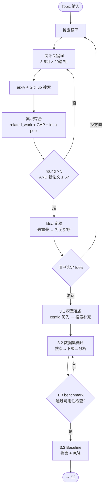

# S1 Flow: Deep Research

**Stage goal**: From user's research topic → produce `related_work.md`, `topic_gap_idea.md`, `assets.md`, `baselines.md`.

### Deliverables

| 文件 | 内容 | 预期形态 |
|------|------|---------|
| `docs/related_work.md` | 文献综述 | 按方法族分节，每篇含 title/venue/method/results/relevance + arxiv link + BibTeX |
| `docs/topic_gap_idea.md` | 研究定位 | Topic → Gap（证据支撑）→ Positioning → Idea Pool（3-5 个，含评分）→ Status |
| `docs/assets.md` | 模型 + 数据集 | 表格：config 模型（已验证）+ 搜索补充模型 + benchmark 数据集，含下载命令和状态 |
| `docs/data_analysis.md` | 数据集可用性分析 | 每个 benchmark 的格式/规模/样本预览/标签/可用性判定 |
| `docs/baselines.md` | Baseline 方法 | 表格：方法/论文/repo/stars/复现难度/状态 |
| `docs/stage1_progress.md` | 搜索日志 | 逐轮记录（关键词/新论文数/GAP 变化/idea 变动/终止决策）+ 全局状态 |

**Exit condition**: 6 个文件全部存在且内容完整，≥ 3 benchmark + ≥ 1 训练数据集通过可用性检查，用户已在决策门选定 idea。



## 1. Search Loop

Iterate the following cycle. **Termination**: round > 5 AND new papers found in current round ≤ 5.

> **Skill invocation**: To invoke a sub-skill, read its `SKILL.md` file and follow the instructions within it. Skills are guidance documents, not executable commands.

### Step 1: Design Keywords
Generate **3–5** search keyword combinations (max 5) based on **all prior context**:
- Round 1: broad topic terms (e.g., "LLM jailbreak attack", "prompt injection defense")
- Later rounds: derive from current GAP analysis and idea pool — target under-explored directions, avoid re-searching saturated areas (e.g., if GAP says "no cross-architecture skill transfer", search "transferable adversarial strategy multi-model")

### Step 2: Search
For each keyword set, invoke `auto-research-s1-arxiv-search` with `max_results=20`.
Also search GitHub (`auto-research-s1-github-search`) for baseline repos when a relevant method is found.
**Count new papers** (not previously seen in prior rounds). From all retrieved papers, select **≤ 10** for deep analysis (criteria: method match + recent + high relevance); the rest are recorded as title/abstract only in `related_work.md`.

### Step 3: Cumulative Synthesis
This is the core of each round. Update ALL THREE documents:

1. **`docs/related_work.md`** — append new paper entries (structured: title, venue, method, key results, relevance). Each entry must include the **arxiv link** and a **BibTeX citation** (see `auto-research-s1-paper-analysis` template).
2. **`docs/topic_gap_idea.md` § Gap Analysis** — update:
   - Which directions are now well-covered (with evidence: paper count, key works)
   - Which gaps remain or newly emerged
   - Contradictions or open questions across papers
3. **`docs/topic_gap_idea.md` § Idea Pool** — update:
   - For each existing idea: note overlap with newly found papers (mark `⚠️ overlap` if a paper already does this)
   - Add new ideas inspired by this round's findings
   - This prevents proposing ideas that existing work already covers

### Step 4: Plan Next Round
Based on the updated GAP and idea pool:
- Which gap directions need deeper search?
- Which keyword angles are exhausted (skip next round)?
- Any new method families discovered that need coverage?

### Step 5: Check Termination
- If round > 5 AND new papers this round ≤ 5 → **stop searching** (minimum rounds done + diminishing returns)
- Otherwise → continue to next round

Log in `docs/stage1_progress.md`:
```markdown
## Round {N}
- Keywords: [list]
- New papers found: {count}
- GAP update: {1-line summary of what changed}
- Idea pool: {added/removed/flagged overlap}
- Decision: continue / terminate (reason)
```

## 2. Positioning & Idea Finalization

After search terminates, finalize the idea pool built during the search loop:

1. Write a positioning statement in `topic_gap_idea.md`:
   ```
   Existing work focuses on [X]. However, [gap]. We propose to [Y] by [key insight].
   ```

2. Review the idea pool — remove ideas flagged `⚠️ overlap`, then for remaining **3–5 ideas** finalize:
   - **Title**: one-line description
   - **Method sketch**: 2–3 sentences on approach
   - **Novelty**: what's new vs. closest existing work (cite specific papers from related_work.md)
   - **Feasibility**: compute/data/timeline estimate (high/medium/low)
   - **Risk**: what could go wrong
   - **Score**: novelty(1-5) × feasibility(1-5)

3. Rank ideas by score. Present to user as decision gate.

## 3. Asset Preparation (Mandatory)

After user confirms an idea, **must** complete all three categories before proceeding to S2. Produce `docs/assets.md` and `docs/baselines.md`.

### 3.1 Models

**Priority: user's `project_config.yaml` first.** Read the `models:` list from config — these are the user's available models. Then supplement:

1. Check if the confirmed idea requires models not in the config (e.g., a larger target model, a specific judge model)
2. If additional models are needed, search via `auto-research-s1-huggingface-query` and `auto-research-s1-modelscope-query`
3. Record ALL models (from config + newly found) in `assets.md`:

```markdown
## Models
| Model | Source | Path / URL | Description | Status |
|-------|--------|-----------|-------------|--------|
| Qwen3-4B | config (local) | /data/models/Qwen3-4B | Backbone for training | ✅ available |
| Qwen3-14B | config (local) | /data/models/Qwen3-14B | Target model | ✅ available |
| qwen-max | config (api) | https://dashscope.../v1 | Remote baseline | ✅ available |
| Llama-3-8B | search (HF) | meta-llama/Llama-3-8B | Cross-family target | ⬜ pending download |
```

### 3.2 Datasets (Iterative)

Datasets are split into two categories with **strict usage boundaries**:

| 类别 | 用途 | 约束 |
|------|------|------|
| **Benchmark**（测试集） | 仅用于评估/测试，**禁止参与训练** | ≥ 3 个，需通过可用性检查 |
| **Training data**（训练数据） | 用于学习/微调/数据增强/RL 训练等 | ≥ 1 个，需满足训练管线格式 |

**Loop** (applies to both categories):
1. **Search**: Identify candidates from the idea's method sketch and related work. Search via `auto-research-s1-huggingface-query` and `auto-research-s1-modelscope-query`.
2. **Download**: Download candidate datasets.
3. **Analyze**: For each downloaded dataset, check:
   - Format: JSONL / CSV / parquet? Loadable by standard scripts?
   - Scale: sample count sufficient? (benchmark: flag if < 100; training: flag if < 500)
   - Content: read 5-10 random samples — are inputs well-formed? Language correct?
   - Labels: does it have the required annotations?
   - Overlap: is it substantially different from already-selected datasets? (avoid near-duplicates)
   - **For training data additionally**: compatible with training pipeline format (e.g., instruction-response pairs for SFT, prompt-only for GRPO)?
4. **Decide**:
   - ✅ Usable → record in `assets.md` (mark category: benchmark / training) + write analysis to `docs/data_analysis.md`
   - ❌ Not usable → log reason, continue searching
5. **Terminate**: ≥ 3 benchmarks AND ≥ 1 training dataset marked usable. If search exhausted without meeting thresholds, report to user.

**`docs/data_analysis.md` format**:
```markdown
## {Dataset Name}
- **Category**: benchmark / training
- **Source**: {platform + ID}
- **Scale**: {N} samples
- **Format**: {JSONL/CSV/...}, fields: {list}
- **Sample preview**: {1-2 example inputs, truncated}
- **Labels**: {description of annotations}
- **Usability**: ✅ / ❌ {reason}
- **Usage restriction**: test-only / training-allowed
- **Selected for**: {main eval / ablation / transfer test / SFT / GRPO / ...}
```

### 3.3 Baselines

Search for open-source implementations of comparable methods:
1. From `related_work.md`, identify the closest 3-5 methods that must be compared against
2. Search via `auto-research-s1-github-search` for repos
3. Evaluate reproduction difficulty (stars, recency, scripts, dependencies)
4. Record in `baselines.md`:

```markdown
| Method | Paper | Repo | Stars | Reproduction | Status |
|--------|-------|------|-------|--------------|--------|
| GCG | arxiv:2307.15043 | llm-attacks/llm-attacks | 800 | ready | ⬜ pending clone |
```

### 3.4 Download & Verify

Execute downloads for all pending items. Update status in `assets.md` / `baselines.md`.
**Exit condition**: All models available (config models verified, additional models downloaded), ≥ 3 benchmarks + ≥ 1 training dataset pass usability check with analysis recorded in `data_analysis.md`, ≥ 2 baseline repos cloned or marked "no public repo".

## 4. Progress Tracking

Maintain `docs/stage1_progress.md`:
```markdown
# Stage 1 Progress
- **Topic**: {topic}
- **Rounds completed**: {N}/5
- **Papers analyzed**: {count}
- **Phase**: search_loop | idea_finalization | asset_prep | gate_pending
- **Last updated**: {date}
```

## 5. Decision Gate

Present to user:
1. Summary of literature landscape (key method families, coverage)
2. Identified gap and positioning
3. Ranked idea list with scores
4. Asset/baseline readiness status

**Wait for user to select an idea before proceeding to S2.**
