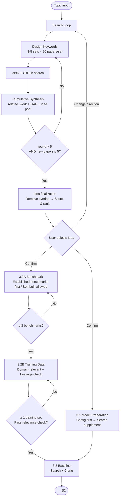

# S1 Flow: Deep Research

**Stage goal**: From user's research topic → produce `related_work.md`, `topic_gap_idea.md`, `assets.md`, `baselines.md`.

### Deliverables

| File | Content | Expected format |
|------|---------|----------------|
| `docs/related_work.md` | Literature review | Organized by method family, each entry with title/venue/method/results/relevance + arxiv link + BibTeX |
| `docs/topic_gap_idea.md` | Research positioning | Topic → Gap (evidence-backed) → Positioning → Idea Pool (3-5, with scores) → Status |
| `docs/assets.md` | Models + Datasets | Table: config models (verified) + search-supplemented models + benchmark datasets, with download commands and status |
| `docs/data_analysis.md` | Dataset usability analysis | Format/scale/sample preview/labels/usability assessment for each benchmark |
| `docs/baselines.md` | Baseline methods | Table: method/paper/repo/stars/reproduction difficulty/status |
| `docs/stage1_progress.md` | Search log | Per-round records (keywords/new paper count/GAP changes/idea changes/termination decisions) + global status |

**Exit condition**: All 6 files exist with complete content, ≥ 3 benchmarks + training data (total samples ≥ 2000, sources ≥ 2) pass usability check, user has selected an idea at the decision gate.



## 1. Search Loop

Iterate the following cycle. **Termination**: round > 5 AND new papers found in current round ≤ 5.

> **Skill invocation**: To invoke a sub-skill, read its `SKILL.md` file and follow the instructions within it. Skills are guidance documents, not executable commands.

### Step 1: Design Keywords
Generate **3–5** search keyword combinations (max 5) based on **all prior context**:
- Round 1: broad topic terms (e.g., "LLM jailbreak attack", "prompt injection defense")
- Later rounds: derive from current GAP analysis and idea pool — target under-explored directions, avoid re-searching saturated areas (e.g., if GAP says "no cross-architecture skill transfer", search "transferable adversarial strategy multi-model")

### Step 2: Search
For each keyword set, invoke `auto-research-s1-arxiv-search` with `max_results=20`.
Also search GitHub (`auto-research-s1-github-search`) for baseline repos when a relevant method is found.
**Count new papers** (not previously seen in prior rounds). From all retrieved papers, select **≤ 10** for deep analysis (criteria: method match + recent + high relevance); the rest are recorded as title/abstract only in `related_work.md`.

### Step 3: Cumulative Synthesis
This is the core of each round. Update ALL THREE documents:

1. **`docs/related_work.md`** — append new paper entries (structured: title, venue, method, key results, relevance). Each entry must include the **arxiv link** and a **BibTeX citation** (see `auto-research-s1-paper-analysis` template).
2. **`docs/topic_gap_idea.md` § Gap Analysis** — update:
   - Which directions are now well-covered (with evidence: paper count, key works)
   - Which gaps remain or newly emerged
   - Contradictions or open questions across papers
3. **`docs/topic_gap_idea.md` § Idea Pool** — update:
   - For each existing idea: note overlap with newly found papers (mark `⚠️ overlap` if a paper already does this)
   - Add new ideas inspired by this round's findings
   - This prevents proposing ideas that existing work already covers

### Step 4: Plan Next Round
Based on the updated GAP and idea pool:
- Which gap directions need deeper search?
- Which keyword angles are exhausted (skip next round)?
- Any new method families discovered that need coverage?

### Step 5: Check Termination
- If round > 5 AND new papers this round ≤ 5 → **stop searching** (minimum rounds done + diminishing returns)
- Otherwise → continue to next round

Log in `docs/stage1_progress.md`:
```markdown
## Round {N}
- Keywords: [list]
- New papers found: {count}
- GAP update: {1-line summary of what changed}
- Idea pool: {added/removed/flagged overlap}
- Decision: continue / terminate (reason)
```

## 2. Positioning & Idea Finalization

After search terminates, finalize the idea pool built during the search loop:

1. Write a positioning statement in `topic_gap_idea.md`:
   ```
   Existing work focuses on [X]. However, [gap]. We propose to [Y] by [key insight].
   ```

2. Review the idea pool — remove ideas flagged `⚠️ overlap`, then for remaining **3–5 ideas** finalize:

```markdown
### Idea: {title}

**Claim**: One-sentence core claim ("X improves Y because Z")
**Causal link**: Why does Z cause Y? (Mechanism hypothesis, not correlation)
**Closest work**: 1-2 closest papers + key differences

**Method Design**:
- **Overview**: Overall method flow (input → Module A → Module B → ... → output)
- **Modules**:
  | Module | Function | Implementation | Tunable design |
  |--------|----------|---------------|----------------|
  | e.g., Skill Retriever | Retrieve relevant skills from library | BM25 lexical matching | Matching algorithm (BM25/embedding), top-k |
  | e.g., Prompt Composer | Inject skills into prompt | Template concatenation | Injection position (system/user), concatenation order |
- **Training** (if applicable): Training objective, data format, loss function
- **Inference**: Inference flow, number of calls, expected cost

**Evidence needed**: What experiments are needed to verify the claim? (Comparison/ablation/analysis)
**Feasibility**: Compute/data/time assessment (high/medium/low)
**Risk**: Most likely failure reason + fallback plan
**Score**: novelty(1-5) × feasibility(1-5)
```

3. Rank ideas by score. Present to user as decision gate.

## 3. Asset Preparation (Mandatory)

After user confirms an idea, **must** complete all three categories before proceeding to S2. Produce `docs/assets.md` and `docs/baselines.md`.

### 3.1 Models

**Priority: user's `project_config.yaml` first.** Read the `models:` list from config — these are the user's available models. Then supplement:

1. Check if the confirmed idea requires models not in the config (e.g., a larger target model, a specific judge model)
2. If additional models are needed, search via `auto-research-s1-huggingface-query` and `auto-research-s1-modelscope-query`
3. Record ALL models (from config + newly found) in `assets.md`:

```markdown
## Models
| Model | Source | Path / URL | Description | Status |
|-------|--------|-----------|-------------|--------|
| Qwen3-4B | config (local) | /data/models/Qwen3-4B | Backbone for training | ✅ available |
| Qwen3-14B | config (local) | /data/models/Qwen3-14B | Target model | ✅ available |
| qwen-max | config (api) | https://dashscope.../v1 | Remote baseline | ✅ available |
| Llama-3-8B | search (HF) | meta-llama/Llama-3-8B | Cross-family target | ⬜ pending download |
```

### 3.2 Datasets (Two-Phase)

Datasets are split into two categories with **strict usage boundaries**:

| Category | Usage | Constraints |
|----------|-------|-------------|
| **Benchmark** (test set) | Evaluation/testing only, **must NOT participate in training** | ≥ 3, must pass usability check |
| **Training data** | For learning/fine-tuning/data augmentation/RL training etc. | ≥ 1, must be domain-relevant to benchmarks |

#### Phase A: Benchmark Selection (First)

**Loop**:
1. **Search**: Prioritize finding **established benchmarks** within the domain (frequently cited evaluation sets in related work). Search via `auto-research-s1-huggingface-query` and `auto-research-s1-modelscope-query`.
2. **Download & Analyze**: Check format/scale/sample content/labels/dedup.
3. **Decide**: ✅ Usable → Record; ❌ Not usable → Continue searching.
4. **Self-built option**: If the research serves specific business needs, or fewer than 3 established benchmarks exist, **self-built benchmarks** are allowed:
   - Explain self-build rationale (no public evaluation set for business scenario / existing benchmarks don't cover target capability)
   - Define construction plan (data source, annotation spec, scale target)
   - Record in `data_analysis.md` and mark as `category: benchmark (self-built)`
   - Self-built benchmarks must also pass usability check (format loadable, samples ≥ 100)
5. **Terminate**: ≥ 3 benchmarks confirmed (established + self-built mix allowed).

#### Phase B: Training Data Selection (Based on selected benchmarks)

> **Why constrain data volume and source count**: Single-source or small-scale training data causes model overfitting to training distribution, exhibiting strong ego and reward hacking behavior during evaluation (e.g., generating fixed templates, bypassing evaluation logic instead of genuinely solving the problem). Multi-source + sufficient volume is the basic prerequisite for mitigation.

**Hard constraints**:
- Training data **total samples ≥ 2000**
- Training data **sources ≥ 2 different datasets** (prevent single-distribution overfitting)

**Loop**:
1. **Search**: Find training data **domain-relevant** to selected benchmarks.
2. **Download & Analyze**: Same checks as Phase A + additional checks:
   - Training pipeline format compatible (SFT needs instruction-response pairs, GRPO needs prompt-only, etc.)
   - Per-dataset volume ≥ 500
3. **Relevance check** (must pass, otherwise ❌ continue searching):
   - **Task-level alignment**: Training data task type must be highly aligned with benchmark. E.g.:
     - benchmark tests jailbreak attack → training data must contain attack prompt generation/rewriting tasks, not just general safety Q&A
     - benchmark tests code generation → training data must contain code instruction-response pairs, not just natural language dialogue
   - **Domain match**: Topic/domain consistent with benchmark (e.g., safety, medical, legal)
   - **No data leakage**: No sample-level overlap between training and test sets
   - Criteria: Randomly sample 10 training examples, ≥ 7 samples whose task form directly corresponds to the benchmark evaluation task
   - ❌ Does not meet task-level alignment → Not usable, continue searching
4. **Diversity check**: Whether collected training data comes from ≥ 2 different sources? Is there distribution diversity? (e.g., one formal instruction style, one colloquial)
5. **Terminate**: Total samples ≥ 2000 AND sources ≥ 2 AND all pass relevance check. If search exhausted without meeting requirements, report to user for discussion (may need to self-build or adjust method).

**`docs/data_analysis.md` format**:
```markdown
## {Dataset Name}
- **Category**: benchmark / benchmark (self-built) / training
- **Source**: {platform + ID / "self-built: construction plan below"}
- **Scale**: {N} samples
- **Format**: {JSONL/CSV/...}, fields: {list}
- **Sample preview**: {1-2 example inputs, truncated}
- **Labels**: {description of annotations}
- **Usability**: ✅ / ❌ {reason}
- **Usage restriction**: test-only / training-allowed
- **Relevance to benchmarks**: {which benchmarks are domain-relevant, leakage check results}
- **Selected for**: {main eval / ablation / transfer test / SFT / GRPO / ...}
```

### 3.3 Baselines

Search for open-source implementations of comparable methods:
1. From `related_work.md`, identify the closest 3-5 methods that must be compared against
2. Search via `auto-research-s1-github-search` for repos
3. Evaluate reproduction difficulty (stars, recency, scripts, dependencies)
4. Record in `baselines.md`:

```markdown
| Method | Paper | Repo | Stars | Reproduction | Status |
|--------|-------|------|-------|--------------|--------|
| GCG | arxiv:2307.15043 | llm-attacks/llm-attacks | 800 | ready | ⬜ pending clone |
```

### 3.4 Download & Verify

Execute downloads for all pending items. Update status in `assets.md` / `baselines.md`.
**Exit condition**: All models available (config models verified, additional models downloaded), ≥ 3 benchmarks + training data (total samples ≥ 2000, sources ≥ 2) pass usability check with analysis recorded in `data_analysis.md`, ≥ 2 baseline repos cloned or marked "no public repo".

## 4. Progress Tracking

Maintain `docs/stage1_progress.md`:
```markdown
# Stage 1 Progress
- **Topic**: {topic}
- **Rounds completed**: {N}/5
- **Papers analyzed**: {count}
- **Phase**: search_loop | idea_finalization | asset_prep | gate_pending
- **Last updated**: {date}
```

## 5. Decision Gate

Present to user:
1. Summary of literature landscape (key method families, coverage)
2. Identified gap and positioning
3. Ranked idea list with scores
4. Asset/baseline readiness status

**Wait for user to select an idea before proceeding to S2.**
