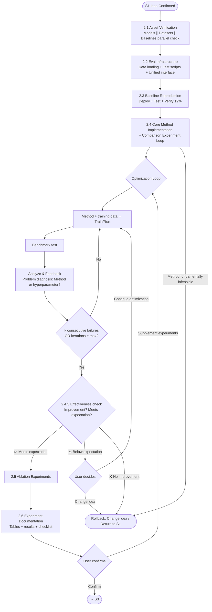

# S2 Flow: Coding & Experimenting

**Stage goal**: From confirmed idea + prepared assets → produce reproducible experiment code (`src/`, `scripts/`, `exp/`), `docs/experiment_results.md`, `docs/pre_review_checklist.md`.



> **Skill invocation**: To invoke a sub-skill, read its `SKILL.md` file and follow the instructions within it. Skills are guidance documents, not executable commands.

> **User interaction**: Throughout S2, the agent may ask the user questions or request guidance at any time (e.g., hyperparameter range confirmation, method design choices, anomalous result interpretation). Don't guess silently — communicate proactively.

## Entry Condition

Verify ALL before starting. If any fails → report to user, do not proceed.

- [ ] `docs/topic_gap_idea.md` exists with user-confirmed idea
- [ ] `docs/assets.md` exists (models + datasets verified)
- [ ] `docs/data_analysis.md` exists (≥ 3 benchmarks + ≥ 1 training data)
- [ ] `docs/baselines.md` exists (baseline methods with repos)
- [ ] `project_config.yaml` exists at project root

## Steps

### 2.1 Asset Verification (Parallel)

**Entry**: Entry condition met.
**Action**: Three asset types checked in **parallel**:

| Check item | Action | Pass criteria |
|--------|------|---------|
| Models | Local: Check path has config.json + safetensors; API: Send test request | All available |
| Datasets | Load each benchmark and training data, verify format and scale | Consistent with data_analysis.md |
| Baseline | Check repo cloned, dependencies installable | All runnable |

Missing items invoke `auto-research-s2-asset-download` to supplement.
**Exit**: ALL items verified.
**Failure**: Block on any unverifiable item, report to user.

### 2.2 Build Eval Infrastructure

**Entry**: All assets verified.
**Action**: Build unified evaluation system:
- **Data loading**: `src/data_loader.py` — Unified interface to load all benchmarks and training data (read format info from `data_analysis.md`)
- **Eval scripts**: `scripts/eval.py` — Unified entry point, supports `--dataset` `--method` `--output` parameters
- **Metric functions**: Determined by idea type (ASR judge, accuracy, BLEU, etc.)
- **Unified interface**: All methods (baseline + core) implement the same `run(inputs) -> outputs` interface

**Result format** (each experiment produces `output/METHOD/DATASET/results.json`):
```json
{
  "method": "method_name",
  "dataset": "benchmark_name",
  "metrics": {"asr": 0.85, "n": 520, "successes": 442},
  "per_sample": [{"prompt": "...", "response": "...", "success": true}]
}
```

**Exit**: `python scripts/eval.py --dummy` runs error-free on synthetic data.
**Failure**: Fix imports/config before proceeding.

### 2.3 Baseline Reproduction

**Entry**: Eval infrastructure working.
**Action**:
1. Deploy required model servers (invoke `auto-research-s2-vllm-deploy`)
2. For each baseline:
   - Wrap as `src/baselines/{name}.py` (unified interface)
   - Create `exp/baseline_{name}.sh`
   - Run tests on **all benchmarks**
   - Compare against paper-reported values
3. **Sanity check**: Primary baseline must be within **±2%** of paper-reported value

**Exit**: All baseline results saved in `output/baselines/`; primary baseline passes sanity check.
**Failure**: Debug (data version, prompt format, generation config). If not passing within ±2%, **do not proceed to 2.4**.

### 2.4 Core Method + Comparison Experiment Loop

**Entry**: Baselines reproduced.
**Action**:

#### 2.4.1 Implement Core Method
- Implement in `src/methods/`, unified interface, YAML/CLI configurable
- If training needed: Train → checkpoint → deploy → evaluate (explicit verification at each step)
- Create `exp/method_{name}.sh`

#### 2.4.2 Comparison Experiment Loop

**Only comparison experiments** (core method vs baselines), no ablation.

**Exploration progression** (reference this hierarchy when diagnosing each iteration):
1. **Pipeline validation**: Method runs end-to-end, produces non-random results
2. **Core component validation**: Key innovation validated in isolation (ruling out other factors)
3. **Hyperparameter tuning**: Tune params on validated core component
4. **Scaling up**: Expand from small sample to full data

```
exp_iter = 0
consecutive_fail = 0

while consecutive_fail < k AND exp_iter < max_exp_iter:
    1. Based on current method + training data, execute one optimization attempt
       - Allow small-scale grid search (hyperparameter combinations, scale < full grid)
       - Record current config
    2. Test on all benchmarks
    3. Analyze & feedback:
       - Compare against baseline: improvement / plateau / degradation?
       - Problem diagnosis: core method design issue or hyperparameter issue?
       - Training curve analysis: overfitting / underfitting / non-convergence?
    4. Judgment:
       - Effective improvement → consecutive_fail = 0, record best config
       - Ineffective / regression → consecutive_fail += 1
       - Record diagnosis → guide next iteration's adjustment
    5. exp_iter += 1
```

**Parameter defaults**: `k = 3` (3 consecutive ineffective optimizations = convergence), `max_exp_iter = 10`. User can override in `project_config.yaml`.

**Per-iteration experiment log** (written to `docs/experiment_log.md`, one entry per iteration):
```markdown
## Exp Iter {N} — {date}

### Config
- Key hyperparams: {list}
- Changed from Iter {N-1}: {what changed and why}

### Results
| Benchmark | Metric | This iter | Best so far | Strongest baseline | Delta vs baseline |
|-----------|--------|-----------|-------------|-------------------|-------------------|

### Training Observations (if applicable)
- Loss trend: {converging / plateau / diverging}
- Notable behavior: {e.g., reward hacking, mode collapse, overfitting}

### Analysis
- What worked: {specific observations}
- What didn't: {specific observations}
- Root cause: {method design / hyperparameter / data quality / other}
- Evidence: {cite specific numbers or samples}

### Decision
- Verdict: effective improvement / ineffective / regression
- consecutive_fail: {N}/{k}
- Next iteration plan: {specific adjustment, referencing exploration progression level}
```

**Experiment script naming convention**:
```
exp/main_{METHOD}_{DATASET}.sh    # Main comparison experiment
exp/ablation_{COMPONENT}.sh       # Ablation experiment
exp/efficiency_{METHOD}.sh        # Efficiency test
exp/transfer_{SRC}_{TGT}.sh       # Transfer experiment
```

**Experiment failure handling**:
1. Log error to `output/EXP_NAME/log.txt`
2. Mark status: SUCCESS / FAILED / BLOCKED
3. Diagnose: OOM → reduce batch size; timeout → increase timeout; import error → fix dependencies
4. **Do not block pipeline** — continue to next experiment, retry after fix

**Exit**: Convergence (k consecutive failures) or max_exp_iter reached. Best config recorded.
**Failure**: Method fundamentally infeasible (all attempts show no signal) → **Rollback**.

#### 2.4.3 Effectiveness Check Gate

After experiment loop terminates, **must** evaluate:
1. **Is there improvement**: Best config vs strongest baseline — positive delta on primary benchmarks?
2. **Meets expectation**: Does improvement magnitude match idea's expectation (reference method sketch in `topic_gap_idea.md`)?

| Judgment | Next step |
|------|------|
| ✅ Improvement and meets expectation | → Proceed to 2.5 ablation |
| ⚠️ Improvement but below expectation | → Report to user, discuss: continue optimization (return to 2.4.2 for additional iterations) / lower expectation and continue / change idea |
| ❌ No improvement or regression | → **Skip ablation**, trigger Rollback (change idea or return to S1) |

### 2.5 Ablation Experiments

**Entry**: 2.4.3 check passed (✅ or ⚠️ user confirms continue).
**Action**:
- Based on ablation list in `pre_review_checklist.md`
- Remove/replace core components one by one, test on benchmarks
- Create `exp/ablation_{component}.sh` for each ablation experiment
- Analyze each component's contribution

**Exit**: All ablation experiments complete, component contributions quantified.
**Failure**: An ablation experiment fails → mark BLOCKED, continue others.

### 2.6 Experiment Documentation

**Entry**: Comparison experiments + ablation experiments complete.
**Action**:
1. Generate `docs/pre_review_checklist.md` (create if not exists):
   - Experiment matrix: method × dataset × metric
   - Mark must-run / nice-to-have
   - Ablation checklist + completion status
2. Invoke `auto-research-s2-result-analysis` to generate:
   - Main results table (method vs baselines, all benchmarks)
   - Ablation table (component contributions)
   - Efficiency data (wall-clock, GPU memory, if applicable)
3. Write `docs/experiment_results.md`:
   - Complete tables + key findings (≤ 7 items)
   - Failure analysis (what didn't work, why)
   - Statistical significance check (improvement < 5% requires multi-seed verification)

**Exit**: `experiment_results.md` + `pre_review_checklist.md` complete.

## Rollback Protocol

- **2.4 method infeasible**: Log failure reason, try next idea from S1 idea pool → restart from 2.4
- **Idea pool exhausted**: Report to user, rollback to S1 for new search
- **Single experiment failure**: Mark BLOCKED, does not trigger overall rollback
- All rollback events logged in `docs/stage2_progress.md`

## Phase State Machine

```
asset_verify → infra_build → baseline_repro → method_loop → ablation → documentation → gate_pending → complete
```

On resume: read phase from `docs/stage2_progress.md`, jump to corresponding step.

## Progress Tracking

Maintain `docs/stage2_progress.md` (high-level status) + `docs/experiment_log.md` (detailed per-iteration log):
```markdown
# Stage 2 Progress
- **Idea**: {confirmed idea title}
- **Phase**: asset_verify | infra_build | baseline_repro | method_loop | ablation | documentation | gate_pending | complete
- **Exp iterations**: {N}/{max_exp_iter}
- **Consecutive fails**: {N}/{k}
- **Best config**: {hyperparams}
- **Best results**: {metric per benchmark}
- **Ideas tried**: {N}/{pool size}
- **Experiment log**: see docs/experiment_log.md
- **Last updated**: {date}
```

## Decision Gate (→ S3)

After 2.6, present to user:
1. Main results table (method vs baselines, all benchmarks)
2. Ablation summary (which components are critical)
3. Sufficiency assessment: strengths + identified weaknesses
4. Recommendation: **proceed to S3** / **supplement experiments** (specify which)

**Wait for user confirmation before marking Stage 2 complete.**
