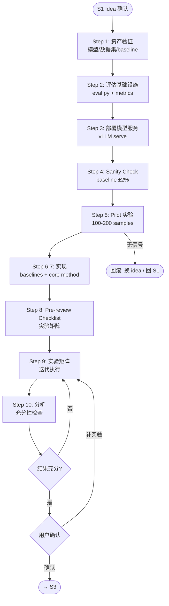

# S2 Flow: Coding & Experimenting

**Stage goal**: From confirmed idea + prepared assets → produce reproducible experiment code (`src/`, `scripts/`, `exp/`), `docs/experiment_results.md`, `docs/pre_review_checklist.md`.



> **Skill invocation**: To invoke a sub-skill, read its `SKILL.md` file and follow the instructions within it. Skills are guidance documents, not executable commands.

## Entry Condition

Verify ALL before starting. If any fails → report to user, do not proceed.

- [ ] `docs/topic_gap_idea.md` exists with user-confirmed idea selected
- [ ] `docs/assets.md` exists (models + datasets with download commands)
- [ ] `docs/baselines.md` exists (baseline methods with repos)
- [ ] `project_config.yaml` exists at project root

## Steps

### Step 1: Asset Verification & Download

**Entry**: Entry condition met.
**Action**:
- Read `project_config.yaml`. For each model in `models:`:
  - Local (`type: local`): check `path` contains `config.json` / `*.safetensors`. If missing → invoke `auto-research-s2-asset-download`.
  - API (`type: api`): invoke `auto-research-s2-model-call` with test prompt (max_tokens=5). If fails → report error, ask user to check URL/key.
- Verify each dataset in `docs/assets.md` is loadable from `data/`.
- Verify each baseline repo in `docs/baselines.md` is cloned and dependencies installable.
- Update status columns in `assets.md` / `baselines.md`.

**Exit**: ALL items in `assets.md` and `baselines.md` marked verified.
**Failure**: Block on any unverifiable item. Report to user with specific error.

### Step 2: Build Eval Infrastructure

**Entry**: All assets verified.
**Action**: Invoke `auto-research-s2-eval-infrastructure` to create:
- `scripts/eval.py` — unified evaluation entry point
- Metric functions (ASR judge, keyword match, etc. — determined by idea type)
- Result I/O format: JSON per-sample + aggregated markdown tables

**Exit**: `python scripts/eval.py --dummy` runs without error on synthetic data.
**Failure**: Fix import/config issues before proceeding.

### Step 3: Deploy Model Servers

**Entry**: Eval infrastructure working. Local models verified in Step 1.
**Action**: For each local model requiring inference, invoke `auto-research-s2-vllm-deploy` to launch a vLLM server. Record endpoints in `project_config.yaml`.
**Exit**: All servers respond to `GET /v1/models` with expected model ID.
**Failure**: Check GPU memory, port conflicts. Retry or report.

### Step 4: Sanity Check — Reproduce Baseline

**Entry**: Servers up, eval script working.
**Action**: Run the primary baseline (first entry in `baselines.md`) on 50–100 samples. Compare against the paper-reported number.
**Exit**: Result within **±2%** of reported value.
**Failure**: Debug (data version, prompt format, hyperparams, generation config). Re-run. Do NOT proceed until within tolerance.

### Step 5: Pilot Experiment

**Entry**: Baseline sanity passed.
**Action**: Run proposed method on 100–200 samples end-to-end:
- Data loading → method execution → evaluation → result saving
- If method requires training: train → save checkpoint → deploy checkpoint (Step 3 pattern) → eval. Each handoff must be explicit and verified.
- **出题型 branch**: pilot is data construction pipeline (generate → filter → annotate subset) + run one baseline on constructed data.

**Exit**: Pipeline completes without crash. Initial signal visible (metric non-trivial, not random).
**Failure**: Debug integration bugs (max 3 attempts). If still no signal → **Rollback** (see below).

### Step 6: Implement Baselines (Full)

**Entry**: Pilot passed.
**Action**: For each baseline in `baselines.md`:
- Wrap in `src/baselines/{name}.py` (OOP interface with `run()`)
- Create `exp/baseline_{name}.sh`
- Run on full dataset, verify reproduction within ±2%
- Reference `auto-research-s2-model-call` for API patterns, `auto-research-s2-vllm-deploy` for serving

**Exit**: All baseline results saved in `output/baselines/`. Reproduction verified.
**Failure**: For any baseline that won't reproduce: document deviation, note in results as "our reimplementation".

### Step 7: Implement Core Method (Full)

**Entry**: Baselines complete.
**Action**: Implement proposed method in `src/methods/`:
- Clean OOP interface, configurable via YAML/CLI
- Logging at key steps
- If training needed: full training run, checkpoint management, redeploy
- Create `exp/method_{name}.sh`
- **出题型 branch**: implement data construction pipeline in `src/data_construction/`, quality metrics in eval

**Exit**: Method runs on full dataset without error. Results saved.
**Failure**: Debug. If fundamental issue → Rollback.

### Step 8: Generate Pre-review Checklist

**Entry**: Core method produces results.
**Action**: Create `docs/pre_review_checklist.md`:
- Experiment matrix: method × dataset × metric
- Mark each cell **must-run** or **nice-to-have**
- Ablation list: components to remove/replace
- Efficiency experiments: wall-clock, GPU memory (if relevant)
- **出题型**: add data quality/diversity metrics, human eval plan

**Exit**: `docs/pre_review_checklist.md` exists with complete matrix.

### Step 9: Run Experiment Matrix (ITERATIVE)

**Entry**: Checklist generated.
**Action**: This is a **loop**, not one-shot:
1. Run all **must-run** experiments first (invoke `auto-research-s2-experiment-runner`)
2. After each batch: invoke `auto-research-s2-result-analysis` for interim tables
3. Assess: missing ablation? Weak result needs another seed? Nice-to-have now feasible?
4. If yes → add to queue, continue loop
5. If no → terminate loop

Log each experiment immediately after completion (see Progress Tracking).

**Termination**: ALL must-run experiments have status SUCCESS.
**Failure**: If an experiment fails 3× → mark BLOCKED, note in checklist, continue with others.

### Step 10: Final Analysis & Sufficiency Check

**Entry**: All must-run experiments complete.
**Action**:
- Invoke `auto-research-s2-result-analysis` for comprehensive tables (main, ablation, efficiency)
- Write `docs/experiment_results.md`: tables + key findings + failure analysis
- Sufficiency check: Do results support the paper claim? Missing comparisons? Statistical significance?
- If insufficient → identify specific gap, add experiments, **loop back to Step 9**

**Exit**: `docs/experiment_results.md` complete. Sufficiency assessed.

## Rollback Protocol

- **Pilot fails (Step 5)**: Log failure reason. Try next idea from S1 idea pool → restart from Step 5.
- **All ideas in pool fail**: Report to user. Rollback to S1 for new idea generation.
- **Individual experiment fails (Step 9)**: Mark BLOCKED, do not rollback entire stage.
- Always log rollback events in `docs/stage2_progress.md`.

## Phase State Machine

For resumption after interruption. Persist in `docs/stage2_progress.md`:

```
asset_verify → infra_build → deploy → sanity → pilot → implementation → experiments → analysis → gate_pending → complete
```

On resume: read phase, jump to corresponding step. Steps are idempotent — safe to re-enter.

## Progress Tracking

Maintain `docs/stage2_progress.md`:
```markdown
# Stage 2 Progress
- **Idea**: {confirmed idea title}
- **Phase**: asset_verify | infra_build | deploy | sanity | pilot | implementation | experiments | analysis | gate_pending | complete
- **Ideas tried**: {N}/{pool size}
- **Last updated**: {date}

## Experiment Log

### {experiment_name}
- Status: SUCCESS / FAILED / BLOCKED
- Config: {key hyperparams}
- Key metric: {value}
- Decision: {why proceed / retry / skip}
```

## Decision Gate (→ S3)

After Step 10, present to user:
1. Main results table (method vs baselines, all datasets)
2. Ablation summary (which components matter)
3. Sufficiency assessment: strengths + identified weaknesses
4. Recommendation: **proceed to S3** / **run more experiments** (specify which)

**Wait for user confirmation before marking Stage 2 complete.**
