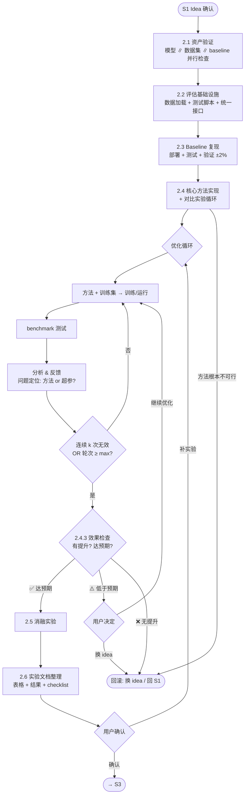

# S2 Flow: Coding & Experimenting

**Stage goal**: From confirmed idea + prepared assets → produce reproducible experiment code (`src/`, `scripts/`, `exp/`), `docs/experiment_results.md`, `docs/pre_review_checklist.md`.



> **Skill invocation**: To invoke a sub-skill, read its `SKILL.md` file and follow the instructions within it. Skills are guidance documents, not executable commands.

> **用户交互**: 整个 S2 过程中，agent 可随时向用户提出问题或请求指示（如超参数范围确认、方法设计选择、异常结果解读）。不要闷头猜测，主动沟通。

## Entry Condition

Verify ALL before starting. If any fails → report to user, do not proceed.

- [ ] `docs/topic_gap_idea.md` exists with user-confirmed idea
- [ ] `docs/assets.md` exists (models + datasets verified)
- [ ] `docs/data_analysis.md` exists (≥ 3 benchmarks + ≥ 1 training data)
- [ ] `docs/baselines.md` exists (baseline methods with repos)
- [ ] `project_config.yaml` exists at project root

## Steps

### 2.1 Asset Verification (Parallel)

**Entry**: Entry condition met.
**Action**: 三类资产**并行**检查：

| 检查项 | 操作 | 通过标准 |
|--------|------|---------|
| 模型 | 本地: 检查 path 有 config.json + safetensors；API: 发送测试请求 | 全部可用 |
| 数据集 | 加载每个 benchmark 和 training data，验证格式和规模 | 与 data_analysis.md 一致 |
| Baseline | 检查 repo 已克隆，依赖可安装 | 全部可运行 |

缺失项调用 `auto-research-s2-asset-download` 补充。
**Exit**: ALL items verified.
**Failure**: Block on any unverifiable item, report to user.

### 2.2 Build Eval Infrastructure

**Entry**: All assets verified.
**Action**: 构建统一评估体系：
- **数据加载**: `src/data_loader.py` — 统一接口加载所有 benchmark 和 training data（从 `data_analysis.md` 读取格式信息）
- **评估脚本**: `scripts/eval.py` — 统一入口，支持 `--dataset` `--method` `--output` 参数
- **指标函数**: 根据 idea 类型确定（ASR judge、accuracy、BLEU 等）
- **统一接口**: 所有方法（baseline + core）实现相同的 `run(inputs) -> outputs` 接口

**结果格式**（每个实验产出 `output/METHOD/DATASET/results.json`）：
```json
{
  "method": "method_name",
  "dataset": "benchmark_name",
  "metrics": {"asr": 0.85, "n": 520, "successes": 442},
  "per_sample": [{"prompt": "...", "response": "...", "success": true}]
}
```

**Exit**: `python scripts/eval.py --dummy` 在合成数据上无错运行。
**Failure**: Fix imports/config before proceeding.

### 2.3 Baseline Reproduction

**Entry**: Eval infrastructure working.
**Action**:
1. 部署所需模型服务（invoke `auto-research-s2-vllm-deploy`）
2. 对每个 baseline：
   - 封装为 `src/baselines/{name}.py`（统一接口）
   - 创建 `exp/baseline_{name}.sh`
   - 在**所有 benchmark** 上运行测试
   - 与论文报告数值对比
3. **Sanity check**: 主 baseline 结果须在论文报告值 **±2%** 内

**Exit**: All baseline results saved in `output/baselines/`，主 baseline 通过 sanity check。
**Failure**: 调试（数据版本、prompt 格式、生成配置）。±2% 内不通过则**不进入 2.4**。

### 2.4 Core Method + Comparison Experiment Loop

**Entry**: Baselines reproduced.
**Action**:

#### 2.4.1 实现核心方法
- 实现于 `src/methods/`，统一接口，YAML/CLI 可配置
- 如需训练：训练 → checkpoint → 部署 → 评估（每步显式验证）
- 创建 `exp/method_{name}.sh`

#### 2.4.2 对比实验循环

**只进行对比实验**（core method vs baselines），不做消融。

**探索递进顺序**（每轮诊断时参照定位问题层级）：
1. **Pipeline 验证**: 方法能跑通，产出非随机结果
2. **核心组件验证**: 关键创新点单独验证有效（排除其他因素）
3. **超参数调优**: 在核心组件有效的基础上调参
4. **规模化**: 从小样本扩展到全量数据

```
exp_iter = 0
consecutive_fail = 0

while consecutive_fail < k AND exp_iter < max_exp_iter:
    1. 基于当前方法 + 训练集，执行一轮优化尝试
       - 允许小规模网格搜索（超参数组合，规模 < 全量网格）
       - 记录本轮配置
    2. 在所有 benchmark 上测试
    3. 分析 & 反馈：
       - 与 baseline 对比：提升/持平/下降？
       - 问题定位：核心方法设计问题 or 超参数问题？
       - 训练曲线分析：过拟合/欠拟合/不收敛？
    4. 判定：
       - 有效提升 → consecutive_fail = 0，记录最优配置
       - 无效/退步 → consecutive_fail += 1
       - 记录诊断结论 → 指导下一轮调整方向
    5. exp_iter += 1
```

**参数默认值**: `k = 3`（连续 3 次优化无效视为收敛），`max_exp_iter = 10`。用户可在 `project_config.yaml` 中覆盖。

**每轮记录**（写入 `docs/stage2_progress.md`）：
```markdown
## Exp Iter {N}
- Config: {key hyperparams}
- Results: {metric per benchmark}
- vs Baseline: {delta}
- Diagnosis: {方法问题 / 超参问题 / 数据问题}
- Decision: {调整方向 / 收敛停止}
```

**实验脚本命名规范**：
```
exp/main_{METHOD}_{DATASET}.sh    # 主对比实验
exp/ablation_{COMPONENT}.sh       # 消融实验
exp/efficiency_{METHOD}.sh        # 效率测试
exp/transfer_{SRC}_{TGT}.sh       # 迁移实验
```

**实验失败处理**：
1. 记录错误到 `output/EXP_NAME/log.txt`
2. 标记状态：SUCCESS / FAILED / BLOCKED
3. 诊断：OOM → 减 batch size；timeout → 加时限；import error → 修依赖
4. **不阻塞流水线**——继续下一个实验，修复后重试

**Exit**: 收敛（连续 k 次无效）或达到 max_exp_iter。最优配置已记录。
**Failure**: 方法根本不可行（所有尝试均无信号）→ **Rollback**。

#### 2.4.3 效果检查门

实验循环结束后，**必须**评估：
1. **是否有提升**: 最优配置 vs 最强 baseline，在主要 benchmark 上是否有正向 delta？
2. **是否达预期**: 提升幅度是否匹配 idea 的预期（参考 `topic_gap_idea.md` 中的 method sketch）？

| 判定 | 后续 |
|------|------|
| ✅ 有提升且达预期 | → 进入 2.5 消融 |
| ⚠️ 有提升但低于预期 | → 向用户报告，讨论：继续优化（回到 2.4.2 追加轮次）/ 降低预期继续 / 换 idea |
| ❌ 无提升或退步 | → **不做消融**，触发 Rollback（换 idea 或回 S1） |

### 2.5 Ablation Experiments

**Entry**: 2.4.3 检查通过（✅ 或 ⚠️ 用户确认继续）。
**Action**:
- 基于 `pre_review_checklist.md` 中的消融列表
- 逐个移除/替换核心组件，在 benchmark 上测试
- 每个消融实验创建 `exp/ablation_{component}.sh`
- 分析每个组件的贡献度

**Exit**: 所有消融实验完成，组件贡献量化。
**Failure**: 某消融实验失败 → 标记 BLOCKED，继续其他。

### 2.6 Experiment Documentation

**Entry**: 对比实验 + 消融实验完成。
**Action**:
1. 生成 `docs/pre_review_checklist.md`（若不存在则创建）：
   - 实验矩阵：method × dataset × metric
   - 标记 must-run / nice-to-have
   - 消融清单 + 完成状态
2. Invoke `auto-research-s2-result-analysis`，生成：
   - 主结果表（method vs baselines，所有 benchmark）
   - 消融表（组件贡献）
   - 效率数据（wall-clock、GPU memory，如适用）
3. 编写 `docs/experiment_results.md`：
   - 完整表格 + key findings（≤ 7 条）
   - 失败分析（哪些没 work，为什么）
   - 统计显著性检查（提升 < 5% 需多 seed 验证）

**Exit**: `experiment_results.md` + `pre_review_checklist.md` 完整。

## Rollback Protocol

- **2.4 方法不可行**: 记录失败原因，尝试 S1 idea pool 中下一个 idea → 从 2.4 重启
- **Idea pool 耗尽**: 报告用户，回滚到 S1 重新搜索
- **单个实验失败**: 标记 BLOCKED，不触发整体回滚
- 所有回滚事件记录到 `docs/stage2_progress.md`

## Phase State Machine

```
asset_verify → infra_build → baseline_repro → method_loop → ablation → documentation → gate_pending → complete
```

On resume: read phase from `docs/stage2_progress.md`, jump to corresponding step.

## Progress Tracking

Maintain `docs/stage2_progress.md`:
```markdown
# Stage 2 Progress
- **Idea**: {confirmed idea title}
- **Phase**: asset_verify | infra_build | baseline_repro | method_loop | ablation | documentation | gate_pending | complete
- **Exp iterations**: {N}/{max_exp_iter}
- **Consecutive fails**: {N}/{k}
- **Best config**: {hyperparams}
- **Ideas tried**: {N}/{pool size}
- **Last updated**: {date}
```

## Decision Gate (→ S3)

After 2.6, present to user:
1. 主结果表（method vs baselines，所有 benchmark）
2. 消融总结（哪些组件关键）
3. 充分性评估：优势 + 已识别弱点
4. 建议：**proceed to S3** / **补实验**（指明哪些）

**Wait for user confirmation before marking Stage 2 complete.**
