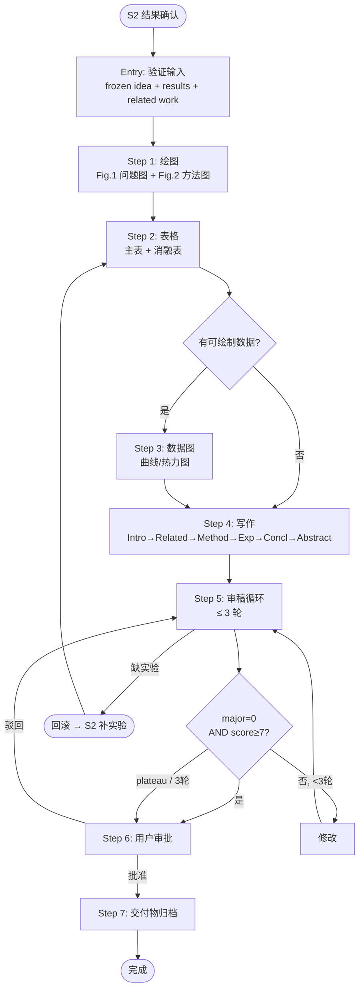

# S3 Flow: Writing & Review

**Stage goal**: From frozen idea + experiment results → produce `paper/paper_draft.md`, `paper/figures/`, `paper/tables/`, `paper/review_responses.md`.



> **Skill invocation**: To invoke a sub-skill, read its `SKILL.md` file and follow the instructions within it. Skills are guidance documents, not executable commands.

## Entry Condition

Verify ALL before starting (abort with error if any missing):
- `docs/topic_gap_idea_frozen.md` exists and contains a positioning statement
- `docs/experiment_results.md` exists with ≥ 1 result table
- `docs/related_work.md` exists with paper entries
- `docs/pre_review_checklist.md` exists (S2 Step 8 output)

## 1. Prepare Figures

### Step 1: Draw Figures (drawio)
- **Entry**: Entry condition satisfied.
- **Action**: Invoke `auto-research-s3-figure-drawio` twice:
  - Fig.1: Problem illustration (≤ 6 nodes) → `paper/figures/fig1_problem.*`
  - Fig.2: Method overview (≤ 10 nodes) → `paper/figures/fig2_method.*`
- **Exit**: Both figure files exist in `paper/figures/`.
- **Failure**: Non-blocking — if drawio unavailable, log text descriptions as placeholders in `paper/figures/README.md` and continue.

## 2. Generate Tables

### Step 2: Tables (BLOCKING)
- **Entry**: `docs/experiment_results.md` has parseable result data.
- **Action**: Invoke `auto-research-s3-table-generator`. Generate main results table + ablation tables.
- **Exit**: `paper/tables/` contains main results and ablation table files.
- **Failure**: BLOCKING — cannot write Experiments section without tables. Report to orchestrator, pause S3.

## 3. Generate Plots (Conditional)

### Step 3: Plots
- **Entry**: Tables generated. Check `docs/experiment_results.md` for plottable data.
- **Action**: Execute ONLY if matching data exists:
  - Training curve data → line plot
  - Parameter sweep → sensitivity plot
  - Cross-model matrix → heatmap
  Invoke `auto-research-s3-figure-plot` for each applicable type.
- **Exit**: Corresponding PDFs in `paper/figures/`, OR skip logged with reason in progress file.
- **Failure**: Non-blocking — log skip reason, continue to writing.

## 4. Write Paper Draft

### Step 4: Full Draft
- **Entry**: Tables exist; figures exist or are placeholder-logged.
- **Action**: Invoke `auto-research-s3-paper-writing`. Writing order: Introduction → Related Work → Method → Experiments → Conclusion → Abstract (last).
- **Exit**: `paper/paper_draft.md` exists with all sections; every table/figure referenced in text.
- **Failure**: If a section cannot be written (missing data), mark `[TODO]` and continue; flag in progress file.

## 5. Review-Revision Loop

### Step 5: Iterative Review (max 3 rounds)
- **Entry**: Complete draft exists.
- **Action**: For each round N = 1, 2, 3:

  a. Invoke `auto-research-s3-paper-review` → append findings to `paper/review_responses.md`.
  b. Log round metrics (see Progress Tracking below).
  c. **Termination check** (stop if ANY true):
     - `major_count == 0` AND `score ≥ 7`
     - `round == 3` (hard cap)
     - Score improved < 0.5 from previous round (plateau)
  d. If continuing: invoke `auto-research-s3-paper-revision`.
  e. If revision flags rollback → execute Rollback Protocol (below).

- **Exit**: Loop terminates with final score and remaining issues logged.
- **Failure**: If review skill unavailable, log and proceed to approval gate with current draft.

## 6. Final Approval Gate

### Step 6: User Decision
- **Entry**: Review loop terminated.
- **Action**: Present to user:
  1. Final draft summary (title, contributions, key results)
  2. Review history (rounds, score trajectory, remaining minor issues)
  3. Outstanding rollback items (if any)
  4. Deliverables checklist status
- **Exit**: User approves → proceed to Step 7. User rejects with feedback → re-enter Step 5 for one additional round (does not count toward 3-round cap).
- **Failure**: N/A — gate blocks until user responds.

## 7. Finalize Deliverables

### Step 7: Verify & Close
- **Entry**: User approval received.
- **Action**: Verify all items exist:
  - [ ] `paper/paper_draft.md` (complete, no `[TODO]` markers)
  - [ ] `paper/figures/` (all figures or documented placeholders)
  - [ ] `paper/tables/` (all tables)
  - [ ] `paper/review_responses.md` (all rounds + rebuttals)
- **Exit**: Mark `docs/stage3_progress.md` status=complete.
- **Failure**: List missing items, report to orchestrator.

## Rollback Protocol

Defined here; `auto-research-s3-paper-revision` references this section.

Triggered when review identifies missing experiments that cannot be addressed by text changes:
1. Mark `status=rollback_pending` in `docs/stage3_progress.md`.
2. List required experiments under "Rollback Required" with specifics (dataset, metric, model).
3. Report to auto-research orchestrator for S2 supplementation.
4. Pause S3 until new results appear in `docs/experiment_results.md`.
5. On resumption: re-run Steps 2→3→4 (affected sections only) → resume review loop at round+1.

## Phase State Machine

For resumption after interruption — set phase in progress file after each step:

```
figures → tables → plots → writing → review_loop → approval → complete
                                         ↑              |
                                         └── rollback ──┘
```

On resume: read `docs/stage3_progress.md`, jump to the recorded phase's step.

## Progress Tracking

Maintain `docs/stage3_progress.md`:
```markdown
# Stage 3 Progress
- **Phase**: figures | tables | plots | writing | review_loop | approval | complete
- **Review rounds**: {N}/3
- **Last score**: {X}/10
- **Last updated**: {date}

## Rollback Required
- (none)
```

Per-round review log (append after each review round):
```markdown
## Review Round {N}
- Score: {X}/10
- Major: {count}, Minor: {count}, Suggestion: {count}
- Key issues: [top 2-3, one line each]
- Revision actions: {N} fixed, {M} acknowledged, {K} flagged rollback
- Score delta: {+X.X}
- Decision: continue / stop (reason)
```
